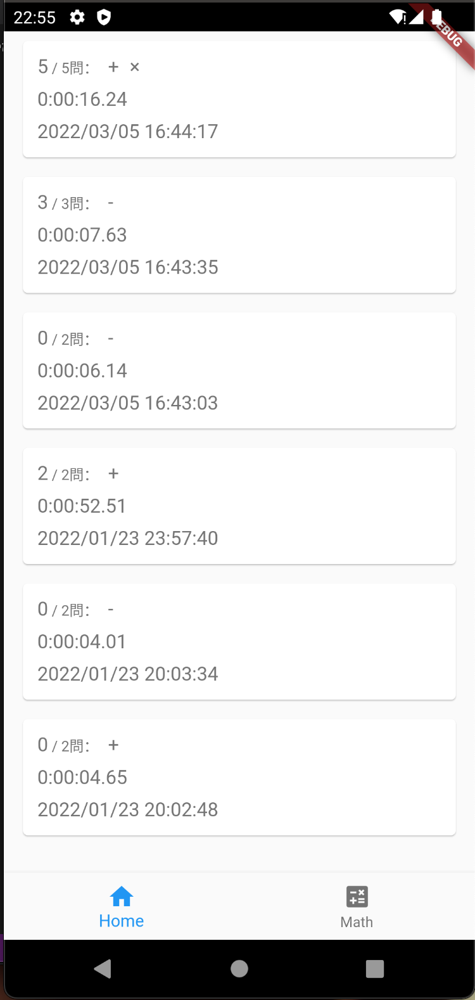
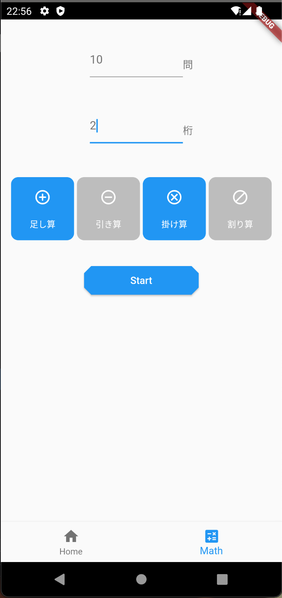
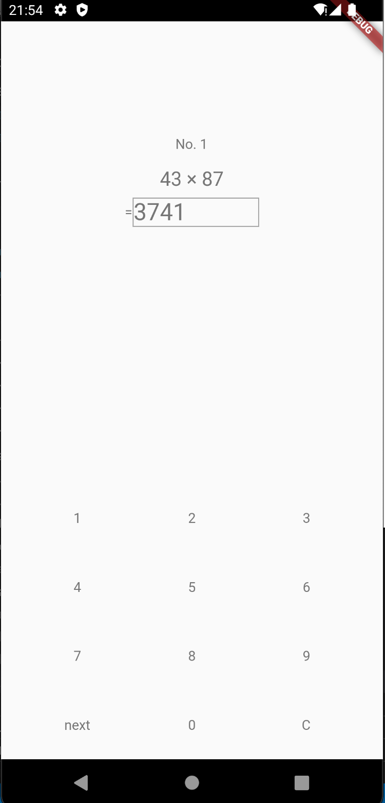

# 計算練習アプリ

## このアプリの特徴
### ローカルDB
- hiveを使用したデータの永久化。

### オリジナルのレイアウト
- 答えを入力するWidgetをオリジナルで実装しています。
 

## 機能概要
## homeタブ
- 結果を見ることができます。
- 「回答時間」「設定した加、減、乗、除」「実行日」を確認できます。

## Mathタブ
- 「出題問題数」「桁数」「加、減、乗、除」を設定できます。

 

## アプリ画面
### homeタブ

### Mathタブ

### 回答画面
